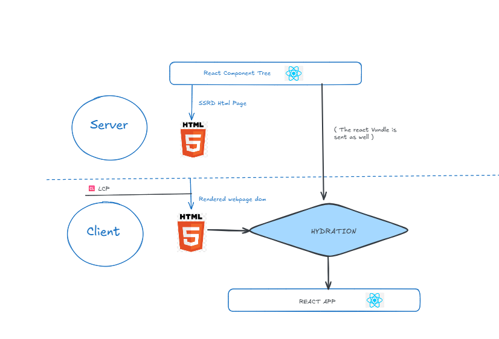

# Basic SSR React App Setup

---

## 📦 Packages Needed for Creating a Basic SSR React App

- **@babel/core** – Core functionality of Babel.
- **@babel/preset-env** – Enables usage of the latest JavaScript features.
- **@babel/preset-react** – Transforms JSX into JavaScript.
- **babel-loader** – Integrates Babel with Webpack.
- **webpack** – Bundles your JavaScript files.
- **webpack-cli** – Provides command-line tools for Webpack.

---

## ❓ Why Do We Need Babel on Both Server and Client?

> We don't always need Babel on the server side if we're only writing simple JavaScript functions.

However, **if you want to use JSX** on the server (e.g., for server-side rendering), then Babel is required to transform the JSX syntax into standard JavaScript.

### ⚠️ Note:
- Do **not** use `<script type="text/babel">` in production.  
  ⛔ It's **slow** and **inefficient**.
  
✅ **Recommended**: Pre-compile your client-side React code using a bundler like Webpack + Babel.

---

## 🛠 Register Babel to Use JSX on the Server

Create a file (e.g., `index.js`) and register Babel there to allow JSX support in Node.js.

### Example: `index.js`


  

```js
require("@babel/register")({
  extensions: [".js", ".jsx"]
});

require("./server.js");


////////////////////////////////////////////////

        Next.js 

//////////////////////////////////////////////


Choose between:

App Router (/app) ✅ Recommended (Next 13+)

Pages Router (/pages) (Legacy)

⚛️ 2. Core React Concepts


🧭 3. Routing & Navigation
File-based Routing (/app or /pages)

🗂️ 4. Layout & Styling


🔄 5. Data Fetching


✍️ 6. Forms & Data Mutation
Controlled/uncontrolled forms


🔐 7. Authentication & Authorization
Using libraries like:


🗃️ 8. Database Integration
ORM: Prisma, Drizzle, Mongoose


📦 9. API Routes / Server Functions


📈 10. State Management


🧪 11. Testing


⚙️ 12. Performance Optimization


🌐 13. SEO & Accessibility


☁️ 14. Deployment


🧩 15. Optional Add-ons


