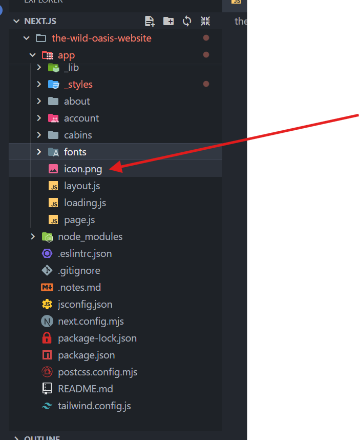
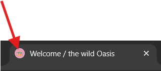
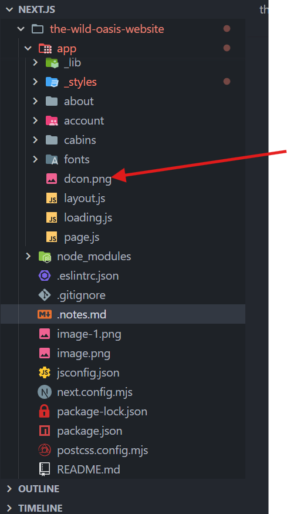
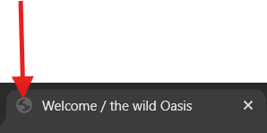

The Next.js documentation is your best friend for this (yes, you need to know how to read and follow documentation as a professional developer 😉).

Link :- https://nextjs.org/docs

To update your project to the latest Next.js version, just run this command in your project folder:

```Next.js Update 

npm install next@latest react@latest react-dom@latest eslint-config-next@latest


You can also follow the Next.js blog where new versions are announced.

But now, let's actually learn Next.js 😎
```


```javascript 
The key thing to understand is this: Server Components never re-render. They run once on the server to generate the UI. The rendered value is sent to the client and locked in place. As far as React is concerned, this output is immutable, and will never change.*

```

/////////////////////////////////////////

        Next.js convention 

//////////////////////////////////////

```javascript

=> So some convention while you working with Next.js so By default for header and meta section you no need to write any extra line of code just add the metatag in the page layout section 

export const metadata = {
  title: {
    template:"%s / The wild Oasis",
    default:"Welcome / the wild Oasis"
  },

  description:"Luxurious cabin hotel , located in the heart of italian Dolomites meets surrounded by beautiful mountains and dark forest ",
  

};


Note:2


For the meta image you have to just creat a icon.png to inject as a metadata






If not write icon then ??






```


/////////////////////////////////////////

        How to add a Font 

////////////////////////////////////////

Because Joesfin_Sans is a function so we need to call it and stoire it 


import {Josefin_Sans} from "next/font/google" ;

Step:-1 

const josefin= Josefin_Sans({
   subsets:["latin"],
   display:"swap",
})


Step:-2

    <body  className={`${josefin.className} bg--950 text-primary-900 min-h-screen 7`}> // Like this way we can add js 

    


//////////////////////////////////////////////////////////////////////////////////////////////////

 Is there any technique without adding any width and hiefht we can see The image on about section ?


//////////////////////////////////////////////////////////////////////////////////////////////////


